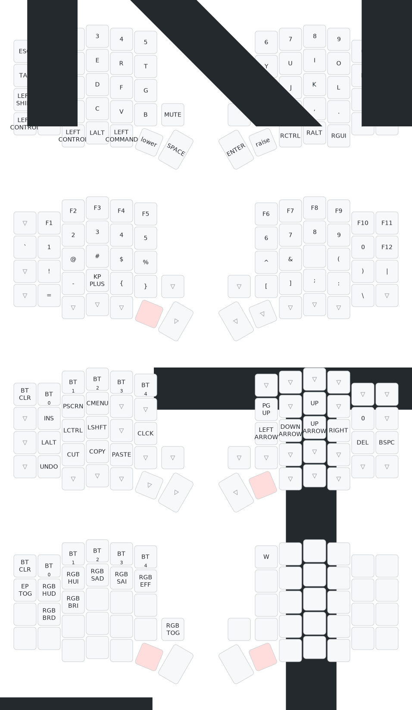

# Sofle V2 ZMK Firmware Repository
Complete ZMK firmware solution for the Ergomech Sofle V2 Wireless keyboard with automated builds and multiple flashing options.

## About This Repository
This is a **standalone repository** providing ready-to-use ZMK firmware for the Sofle V2 keyboard. The Sofle V2 is a 6×4+5 keys column-staggered split keyboard using Cherry MX switches and Nice!Nano microcontrollers.

## Features
- 🚀 **Automatic firmware builds** via GitHub Actions
- 📦 **Easy releases** - download directly from the Releases tab
- 🔧 **Multiple flashing methods** - automated scripts, web interface, or manual
- 🎛️ **ZMK Studio support** on the left side for live keymap editing
- 📱 **OLED display support** with connection status indicators
- 🔋 **Wireless connectivity** with battery monitoring

## Default keymap
The default keymap of this keyboard can be found here:


## Flashing the Sofle V2

### 🚀 Easy Firmware Download (Recommended)
This repository automatically builds and releases firmware files! No need to manually run workflows.

**📦 Get Latest Firmware:**
1. Go to the [**Releases**](../../releases) page (much easier than Actions tab!)
2. Download the latest release
3. You'll get clearly named files:
   - `LEFT-sofle_left-nice_nano_v2-zmk.uf2` - **Flash to LEFT side** (has ZMK Studio support)
   - `RIGHT-sofle_right-nice_nano_v2-zmk.uf2` - **Flash to RIGHT side**
   - `RESET-settings_reset-nice_nano_v2-zmk.uf2` - **Settings reset utility**

### 🔧 Multiple Flashing Methods Available

#### Method 1: Automated Scripts (Easiest!)
We provide automated flashing scripts that detect your keyboard and guide you through the process:

**Python Script (Cross-platform):**
```bash
python3 flash_firmware.py
```

**Shell Script (macOS/Linux):**
```bash
./flash_firmware.sh
```

These scripts will:
- ✅ Automatically detect when your keyboard enters bootloader mode
- ✅ Guide you through flashing each side
- ✅ Provide clear success/error messages
- ✅ Recommend the optimal flashing order

#### Method 2: Web-Based Flasher
Open `web_flasher.html` in your browser (Chrome/Edge/Opera) for a graphical flashing interface.

#### Method 3: Manual Flashing (Traditional)
The traditional drag-and-drop method is still available and explained below.

### 🔄 Building Your Own Firmware (Advanced Users)
If you want to modify the keymap and build custom firmware:

1. **Fork or clone** this repository to your own GitHub account
2. **Modify** the keymap files in the `config/` directory to customize your layout
3. **Push changes** to trigger automatic builds via GitHub Actions
4. **Download** your custom firmware from the Releases page

This repository uses an automated GitHub workflow that leverages the zmkfirmware/zmk build system to compile firmware automatically on every push to the main branch. No local build environment required!

## 📋 Manual Flashing Instructions (Method 3)

### ⚠️ Important Pre-Flashing Steps
- **Power Management:** Only ONE side should be powered during flashing. Turn off the other side completely.
- **Bootloader Mode:** Press the "BOOT" button **twice quickly** to enter bootloader mode
- **Troubleshooting:** If having issues, flash the `RESET` firmware first to clear settings

### 🔄 Recommended Flashing Order
1. **Optional:** Flash `RESET-settings_reset-nice_nano_v2-zmk.uf2` to either side first (clears all settings)
2. **First:** Flash `RIGHT-sofle_right-nice_nano_v2-zmk.uf2` to the right side
3. **Second:** Flash `LEFT-sofle_left-nice_nano_v2-zmk.uf2` to the left side (has ZMK Studio support)

### 🛠️ Step-by-Step Manual Flashing
1. **Connect** the keyboard side to your computer via USB-C cable
2. **Enter Bootloader:** Press the "BOOT" button twice quickly in succession
3. **Verify:** The keyboard should appear as a USB drive on your computer
4. **Flash:** Drag and drop the correct `.uf2` file to the USB drive
5. **Wait:** The keyboard will automatically reboot with new firmware

### ✅ Verify Successful Installation
- After flashing both sides, turn on the right side
- Look for a **checkmark next to the WiFi icon** on the OLED display
- This indicates the sides have successfully paired
- Test typing in your favorite text editor

### 🖥️ Operating System Notes
- **Windows 10/11:** ✅ Confirmed working
- **macOS:** ✅ Confirmed working  
- **Linux:** ✅ Confirmed working
- **Note:** Some OS may show an error when the keyboard reboots - this is normal and indicates successful flashing

## 🔧 Troubleshooting

### Common Issues and Solutions

**❌ "Keyboard not detected" or "No USB drive appears"**
- Double-check you pressed BOOT button **twice quickly** (not once, not slowly)
- Try a different USB-C cable (some cables are power-only)
- Make sure the other keyboard side is completely powered off
- Wait 10 seconds and try the double-tap again

**❌ "Firmware file won't copy" or "Access denied"**
- Make sure you're using the correct `.uf2` file for the side you're flashing
- Try copying to a different location first, then to the keyboard drive
- Restart your computer and try again
- Check if your antivirus is blocking the operation

**❌ "Sides won't pair" or "No checkmark on WiFi icon"**
- Flash the RESET firmware to both sides first
- Make sure you flashed the correct firmware to each side (LEFT vs RIGHT)
- Power cycle both sides: turn off, wait 10 seconds, turn on right side first
- Check battery levels - low battery can cause pairing issues

**❌ "Keys not working" or "Wrong key mappings"**
- Verify you downloaded firmware from the correct repository/release
- Check that you flashed the LEFT firmware to the left side and RIGHT to the right side
- Try flashing the RESET firmware and then re-flash the main firmware

**❌ "ZMK Studio not working"**
- ZMK Studio only works with the LEFT side (it has the special configuration)
- Make sure you're connecting to the left side via USB
- Update to the latest ZMK Studio version

### 🆘 Still Having Issues?
1. Try the automated flashing scripts - they handle many edge cases automatically
2. Use the RESET firmware to clear all settings and start fresh
3. Check the [ZMK Discord](https://discord.gg/8cfMkQksSB) for community support
4. Open an issue on this repository with details about your problem

## Modifying the keymap

### ZMK Keymap
We recommend at least reviewing the [ZMK Keymap documentation](https://zmk.dev/docs/features/keymaps) to understand the structure of the keymap files. This
will help you understand the changes we are making to the generated files. While not required, most example keymaps attempt to show the layout of the keyboard
shown as a comment underneath the layer declaration.

### ZMK Firmware
ZMK does provide an online [keymap editor](https://nickcoutsos.github.io/keymap-editor) and you can use this to change the keymap, this repo is already setup for the use of this editor.

#### Modifying the keymap with the keymap editor

#### Modifying the keymap manually
The exact spacing doesn't matter, but keeping the indentation consistent can be helpful for reading your keymap files. If you indent each button it will be easier
to confirm the structure of the keymap. Take a look at the [default keymap](config/sofle.keymap) to see how this was done. 

The Ergomech Sofle V2 has a 5 way switch on the right side keyboard. The location of the key presses on the 5 way switch are on the last line of the `bindings` section of each layer.
As long as the correct number of entries exist on that row, the 5 way switch will work. 
